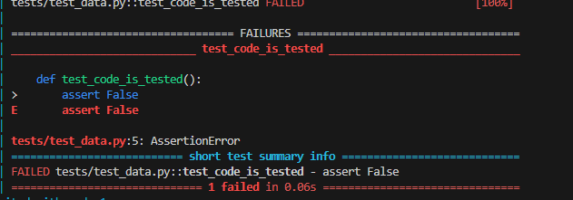
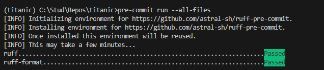
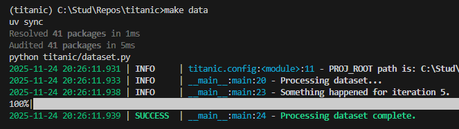

# Initial Report

## Задача

ДЗ 1: Настройка рабочего места Data Scientist

**Баллы:** 8 баллов  
**Срок сдачи:** 24 ноября

### Описание

Настройте полноценное рабочее место для Data Science с использованием современных инженерных практик.

### Требования

1. **Структура проекта (2 балла):**
   - Создать структуру папок с помощью Cookiecutter или Copier
   - Настроить шаблоны для новых проектов
   - Создать README с описанием проекта

2. **Качество кода (2 балла):**
   - Настроить pre-commit hooks
   - Настроить форматирование кода (Black, isort, Ruff)
   - Настроить линтеры (Ruff, MyPy, Bandit)
   - Создать конфигурационные файлы

3. **Управление зависимостями (2 балла):**
   - Настроить пакетный менеджер (например poetry или pixi) для управления зависимостями
   - Создать pyproject с точными версиями
   - Настроить виртуальное окружение
   - Создать Dockerfile для контейнеризации

4. **Git workflow (1 балл):**
   - Настроить Git репозиторий
   - Создать .gitignore для ML проекта
   - Настроить ветки для разных этапов работы

5. **Отчет о проделанной работе (1 балл):**
   - Создать отчет в формате Markdown
   - Описать настройку каждого инструмента
   - Добавить скриншоты результатов
   - Сохранить отчет в Git репозитории

### Критерии оценки

- **Отлично (8 баллов):** Все требования выполнены, код качественный
- **Хорошо (6-7 баллов):** Основные требования выполнены
- **Удовлетворительно (4-5 баллов):** Большинство требований выполнено
- **Неудовлетворительно (0-3 балла):** Требования не выполнены

**⚠️ ВАЖНО:** Менторы будут воспроизводить ваши результаты, поэтому постарайтесь все автоматизировать. Если что-то не совпадет при воспроизведении, можно потерять баллы.

## Преподготовка

Создадим папку проекта, подгрузим шаблон, подтянем окружение.

1. Установил uv
2. `mkdir titanic`, `cd titanic`
3. Создал и активировал venv

   ```bash
   uv venv --python 3.12.12
   .venv/Scripts/activate.bat
   ```

4. Поставил cookiecutter

   `uv pip install cookiecutter-data-science`

5. Кастомизировал шаблон и создал проект

    ```bash
    (titanic) C:\Stud\Repos\titanic>ccds
    project_name (project_name): titanic
    repo_name (titanic): titanic
    module_name (titanic): 
    author_name (Your name (or your organization/company/team)): 3ndetz
    description (A short description of the project.): Solving simple titanic competition with advanced engineering practices
    python_version_number (3.10): 3.12.12
    Select dataset_storage
        1 - none
        2 - azure
        3 - s3
        4 - gcs
        Choose from [1/2/3/4] (1): 1
    Select environment_manager
        1 - virtualenv
        2 - conda
        3 - pipenv
        4 - uv
        5 - pixi
        6 - poetry
        7 - none
        Choose from [1/2/3/4/5/6/7] (1): 4
    Select dependency_file
        1 - requirements.txt
        2 - pyproject.toml
        3 - environment.yml
        4 - Pipfile
        5 - pixi.toml
        Choose from [1/2/3/4/5] (1): 2
    Select pydata_packages
        1 - none
        2 - basic
        Choose from [1/2] (1): 
    Select testing_framework
        1 - none
        2 - pytest
        3 - unittest
        Choose from [1/2/3] (1): 2
    Select linting_and_formatting
        1 - ruff
        2 - flake8+black+isort
        Choose from [1/2] (1): 
    Select open_source_license
        1 - No license file
        2 - MIT
        3 - BSD-3-Clause
        Choose from [1/2/3] (1): 2
    Select docs
        1 - mkdocs
        2 - none
        Choose from [1/2] (1): 1
    Select include_code_scaffold
        1 - Yes
        2 - No
        Choose from [1/2] (1): 
    ```

    Всё создалось на уровне ниже (`titanic/titanic`), поэтому в следующий раз перед `ccds` буду делать `cd ..`

## Настройка

1. Настроим gitignore, пока что уберём uv.lock
2. Добавим .env.example
3. Добавим pre-commit hook в .pre-commit-config.yaml (Конфиги линтера уже подтянулись от cookiecutter в pyproject.toml, поэтому настраиваю только пре-коммит)
4. Добавим pre-commit его в pyproject.toml через `uv add`.

    Важная ремарка: пока не ставлю точные версии пакетов в pyproject.toml, зафиксирую уже когда буду работать с питоном, данными, экспериментами.
5. Сделаем докерфайл `Dockerfile`
6. докеркомпоз (т.к. мне неудобно запускать через докерфайл, проще сразу делать композ)
7. Забилдил gh pages c документацией сразу
   1. делал просто `cd docs` && `mkdocs gh-deploy`
8. Обновил ридми, добавил ссылок

## Итоги и скрины

Подготовил репозиторий к работе.

Докер `docker-compose up --build` ставит зависимости и запускает "тесты", пока там просто заглушка, которая выбивает fail, так и должно быть:



Пре-коммит работает:

`pre-commit run --all-files`



Тестовые штуки (из шаблона самого cookiecutter) работают, например `make data`:


