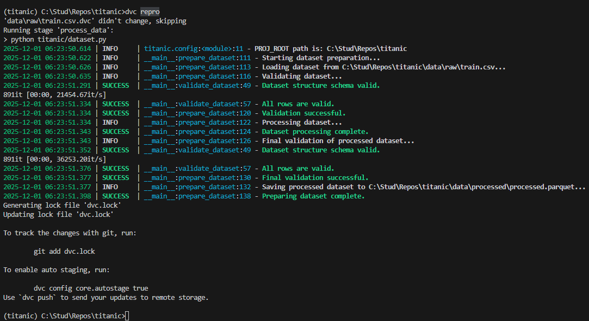

# Homework 2

ДЗ 2 "Версионирование данных" + Семинар 1.3 "Организация хранения данных"

## Задача

ДЗ 2: Версионирование данных и моделей
--------------------------------------

*   **Баллы:** 10 баллов  
    
*   **Срок сдачи:** 8 декабря

### Описание

Настройте систему версионирования данных и моделей для ML проекта.

### Требования

**Выберите ОДИН из инструментов для версионирования данных:**

*   **DVC** - Data Version Control
*   **LakeFS** - Git-like data versioning
*   **Git LFS** - Git Large File Storage

**Выберите ОДИН из инструментов для версионирования моделей:**

*   **MLflow** - Model registry
*   **DVC** - Model versioning

1.  **Настройка выбранного инструмента для данных (4 балла):**
    *   Установить и настроить выбранный инструмент
    *   Настроить remote storage (S3/Local)
    *   Создать систему версионирования данных
    *   Настроить автоматическое создание версий
2.  **Настройка выбранного инструмента для моделей (3 балла):**
    *   Настроить выбранный инструмент для моделей
    *   Создать систему версионирования моделей
    *   Настроить метаданные для моделей
    *   Создать систему сравнения версий
3.  **Воспроизводимость (2 балла):**
    *   Создать инструкции по воспроизведению
    *   Настроить фиксацию версий зависимостей
    *   Протестировать воспроизводимость
    *   Создать Docker контейнер
4.  **Отчет о проделанной работе (1 балл):**
    *   Создать отчет в формате Markdown
    *   Описать настройку выбранных инструментов
    *   Добавить скриншоты результатов
    *   Сохранить отчет в Git репозитории

### Критерии оценки

*   **Отлично (10 баллов):** Полная настройка, качественное версионирование
*   **Хорошо (8-9 баллов):** Хорошая настройка, базовое версионирование
*   **Удовлетворительно (6-7 баллов):** Базовая настройка
*   **Неудовлетворительно (0-5 баллов):** Требования не выполнены

**⚠️ ВАЖНО:** Менторы будут воспроизводить ваши результаты, поэтому постарайтесь все автоматизировать. Если что-то не совпадет при воспроизведении, можно потерять баллы.

-----

**СЕМИНАР - Тема 1.3: Организация хранения данных в ML проекте**

**Задание:** Спроектируйте и реализуйте систему хранения данных для ML проекта.

**Примерный план действий:**

1.  **Подготовка данных:**
    *   Скачать датасет [Titanic](https://www.kaggle.com/competitions/titanic) для демонстрации
    *   Создать дополнительные синтетические данные для полноты примера
    *   Подготовить метаданные и схемы данных
2.  **Проектирование структуры:**
    *   Создать папки: `data/raw/`, `data/processed/`, `data/features/`, `data/models/`
    *   Настроить структуру метаданных (JSON/YAML файлы)
    *   Создать схему валидации данных с помощью Pydantic
3.  **Настройка DVC:**
    *   Инициализировать DVC в проекте
    *   Настроить remote storage
    *   Создать .dvc файлы для каждого типа данных
    *   Настроить автоматическое создание версий
4.  **Автоматизация:**
    *   Создать скрипты для загрузки и валидации данных
    *   Настроить автоматические проверки качества данных
    *   Интегрировать с ML пайплайнами
5.  **Документирование:**
    *   Создать README с описанием структуры данных
    *   Документировать процесс добавления новых данных
    *   Создать примеры использования API для работы с данными

**Что показать:**

*   Структура папок и файлов проекта
*   DVC команды для работы с версиями данных
*   Автоматические проверки качества данных
*   Интеграция с ML пайплайном (обучение модели)


## Ход работы

Подробно описываю каждый шаг + делаю некоторые дополнительные к ДЗ штуки, т.к. также рассказываю эту часть на семинаре.

### DVC configure

Создал папки `data/features`, `data/models`

В [доке](/docs/docs/data.md#общая-структура) рассказываю про структуру.

Поставил dvc через `uv add dvc`, последняя совместимая версия добавилась в зависимости и установилась.

Перешёл в папку проекта.

Инициализировал dvc в проекте через `dvc init`, закоммитил.

Чтобы настроить remote storage на Google Drive, поставил dvc-gdrive через `uv add dvc-gdrive`.

Создал папку на Google диске и открыл её. Скопировал ID папки из URL на доступ к папке.

`dvc remote add -d gdrive gdrive://1WMCtg9vrrCxDIPwooZRiZVV5mRVs2Bmv`

В `.gitignore` добавил исключение для всех `.dvc` файлов, чтобы они попадали в git.

Скачал с kaggle все csv'шки из Titanic, кинул их в папку `data/raw`.

Добавил данные в dvc через команды:

```bash
dvc add data/raw/train.csv
dvc add data/raw/test.csv
dvc add data/raw/gender_submission.csv
```

При `dvc push` попросило авторизоваться в gdrive, выдало [ошибку](https://discuss.dvc.org/t/gdrive-this-app-is-blocked/2191).

Нашёл [причину](https://github.com/treeverse/dvc/issues/10516#issuecomment-2289652067), попробую сделать через google cloud. У DVC есть [инструкция](https://doc.dvc.org/user-guide/data-management/remote-storage/google-drive#using-a-custom-google-cloud-project-recommended).

Следую инструкции. Создал app, сделал credentials, добавил свой email в тестировщики в [audience](https://console.cloud.google.com/auth/audience?project=my-dvc-storage).

```bash
(titanic) C:\Stud\Repos\titanic>dvc remote modify gdrive gdrive_client_id <YOUR_CLIENT_ID>

(titanic) C:\Stud\Repos\titanic>dvc remote modify gdrive gdrive_client_secret <YOUR_CLIENT_SECRET>
```

Если захотите затестить, тегните в тг и киньте gmail, добавлю в тестировщики этого google app, чтобы дался доступ, и дам креды.

[UPD] Попробовал через сервисный аккаунт Google для большей гибкости, создал его, дал доступ к папке на гугл диске, скачал json с кредами и указал в DVC. Если есть ваш service аккаунт, могу дать доступ к нему. Email можно посмотреть в [консоли](https://console.cloud.google.com/iam-admin/serviceaccounts/).

Креды добавлял так (скачал сначала по [инструкции](https://doc.dvc.org/user-guide/data-management/remote-storage/google-drive#using-service-accounts)):

```bash
dvc remote modify --local gdrive gdrive_service_account_json_file_path C:/Users/имя-юзера-windows/.gdrive/id-сервисного-аккаунта.json

dvc remote modify --local gdrive gdrive_service_account_user_email my-dvc-project@my-dvc-storage.iam.gserviceaccount.com
```

Включил сервисный аккаунт:

`dvc remote modify gdrive gdrive_use_service_account true`

Теперь `dvc push` сработал. Тяжко, долго, но сработал.

### Подготовка данных

Подготовим скрипты для обработки данных и схемы данных

Добавим pydantic, pandera и pandas через `uv add`, точные версии зафиксировались.

Создадим шаг пайплайна в dvc, который сделает нам dvc.yaml.

`dvc stage add -n process_data -d titanic/dataset.py -d data/raw/train.csv -o data/processed/processed.parquet python titanic/dataset.py`

Потом повертел, поменял его (`dvc.yaml`) в соответствии с новыми схемамми данных.

По итогу подготовил новую структуру схем данных, совместимую с pydantic и pandera. Описал в доках, `docs/data.md`

Теперь сможем запустить `dvc repro process_data`.

Запускаю.



Успешно. Появился паркет на выходе. Паркет читается data wrangler'ом.
`.dvc` файл ожидаемо не создался т.к. он отслеживается в `dvc.yaml`.
Делаем коммит в гит и `dvc push`, всё фиксируем.

Обновил доку по данным, добавил рекомендации по текущему API.
