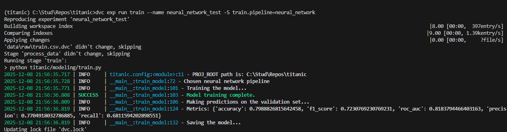

# Homework 3

## Задача

ДЗ 3: Трекинг экспериментов

* **Баллы:** 12 баллов  

* **Срок сдачи:** 8 декабря

### Описание

Настройте систему трекинга экспериментов и проведите серию ML экспериментов.

### Требования

**Выберите ОДИН из инструментов для трекинга экспериментов:**

* **MLflow** - Open source ML platform
* **Weights & Biases** - Cloud-based experiment tracking
* **Neptune** - Team collaboration platform
* **TensorBoard** - TensorFlow visualization toolkit
* **CleaML** - MLOPS platform
* **DVC** - Data Version Control

1. **Настройка выбранного инструмента (4 балла):**
    * Установить и настроить выбранный инструмент
    * Настроить базу данных/облачное хранилище
    * Создать проект и эксперименты
    * Настроить аутентификацию и доступ
2. **Проведение экспериментов (4 балла):**
    * Провести 15+ экспериментов с разными алгоритмами
    * Настроить логирование метрик, параметров и артефактов
    * Создать систему сравнения экспериментов
    * Настроить фильтрацию и поиск экспериментов
3. **Интеграция с кодом (2 балла):**
    * Интегрировать выбранный инструмент в Python код
    * Создать декораторы для автоматического логирования
    * Настроить контекстные менеджеры
    * Создать утилиты для работы с экспериментами
4. **Отчет о проделанной работе (2 балла):**
    * Создать отчет в формате Markdown
    * Описать настройку выбранного инструмента
    * Добавить скриншоты результатов
    * Сохранить отчет в Git репозитории

### Критерии оценки

* **Отлично (12 баллов):** Полная настройка, качественные эксперименты
* **Хорошо (10-11 баллов):** Хорошая настройка, базовые эксперименты
* **Удовлетворительно (8-9 баллов):** Базовая настройка
* **Неудовлетворительно (0-7 баллов):** Требования не выполнены

**⚠️ ВАЖНО:** Менторы будут воспроизводить ваши результаты, поэтому постарайтесь все автоматизировать. Если что-то не совпадет при воспроизведении, можно потерять баллы.

## Ход работы

`git checkout -b hw3`

В целом мы всё настроили под DVC ещё в [HW2](hw2.md), поэтому здесь мы просто добавим ещё экспериментов и алгоритмы.

Эксперименты у нас версионируются (через сохранение), результаты смотрятся прямо в dvc.

Добавил градиентный бустинг и нейронную сеть (MLP) в train.py.




Добавил параметры, обновил конфиг.
Теперь проведём ряд экспериментов (15)

```bash
dvc exp run train --name rf_1 -S train.pipeline=random_forest 
dvc exp run train --name rf_2 -S train.pipeline=random_forest -S train.n_estimators=10 -S train.max_depth=5
dvc exp run train --name rf_3 -S train.pipeline=random_forest -S train.n_estimators=10 -S train.max_depth=5

dvc exp run train --name rf_4_bad -S train.pipeline=random_forest -S test_size=0.5
dvc exp run train --name rf_5_bad -S train.pipeline=random_forest -S test_size=0.9


dvc exp run train --name nn_1 -S train.pipeline=neural_network
dvc exp run train --name nn_2 -S train.pipeline=neural_network -S train.x_size=150 -S train.y_size=75
dvc exp run train --name nn_3 -S train.pipeline=neural_network -S train.x_size=200 -S train.y_size=100

dvc exp run train --name nn_4_bad -S train.pipeline=neural_network -S test_size=0.5
dvc exp run train --name nn_5_bad -S train.pipeline=neural_network -S test_size=0.9


dvc exp run train --name gb_1 -S train.pipeline=gradient_boosting -S train.n_estimators=10 -S train.max_depth=5
dvc exp run train --name gb_2 -S train.pipeline=gradient_boosting -S train.n_estimators=50 -S train.max_depth=10
dvc exp run train --name gb_3 -S train.pipeline=gradient_boosting -S train.n_estimators=100 -S train.max_depth=15

dvc exp run train --name gb_4_bad -S train.pipeline=gradient_boosting -S test_size=0.5
dvc exp run train --name gb_5_bad -S train.pipeline=gradient_boosting -S test_size=0.9
```

DVC VS Code Extension скриншот окна Experiments (в окне команд VSC Надо ввести `>DVC Show Experiments`)

Выбираем лучший эксперимент и применяем

`dvc exp apply <experiment_id>`

Закоммитил, запушил, `dvc push`.
