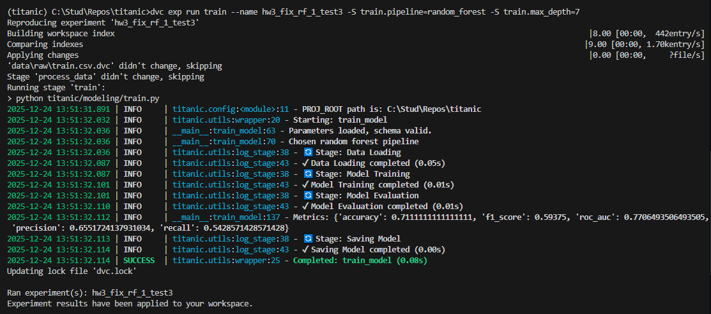

# HW 3 FIX

Трекинг экспериментов с инструментом DVC

## Задача

не хватает реализации в пунктах "Интеграция с кодом", например нет декораторов для автоматического логирования и нет контекстных менеджеров

Требования подробнее:

Интеграция с кодом (2 балла):

- Интегрировать выбранный инструмент (DVC) в Python код
- Создать декораторы для автоматического логирования
- Настроить контекстные менеджеры
- Создать утилиты для работы с экспериментами

## Ход работы

Внесём исправления. Будем работать в новой ветке для удобства.

`git checkout -b hw3-fix`

Ветка поверх hw4, но они не конфликтуют с hw3, поэтому делаем её прямо из мейна. Пройдёмся ещё раз по требованиям интеграции с кодом:

**Интегрировать выбранный инструмент (DVC) в Python код** - Требования выполнено, т.к. DVC подставляет params.yaml в код автоматически, и в коде есть его обработка. `dvc.yaml` также корректно настроен.

Перейдём к следующим пунктам: автоматическое логирование, контекстные менеджеры и утилиты. Объединим всё в 1 пункт, т.к. мы создадим `.py` файл с утилитами для автологирования, поместим туда декоратор, контекстный менеджер, а затем внедрим всё в код.

Создам файл `utils.py` в папке-кодовой базе `titanic/`.

Сделал log_execution декоратор и log_stage менеджер.

Внедрил в `titanic/modeling/train.py` (добавил и то, и другое в функции в коде).

Запустил `dvc exp run train --name hw3_fix_rf_1_test3 -S train.pipeline=random_forest -S train.max_depth=7`: в консоли видим, что всё окей, видим также удобные логи времени выполнения.

