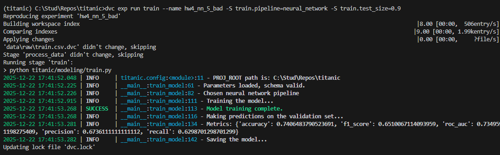
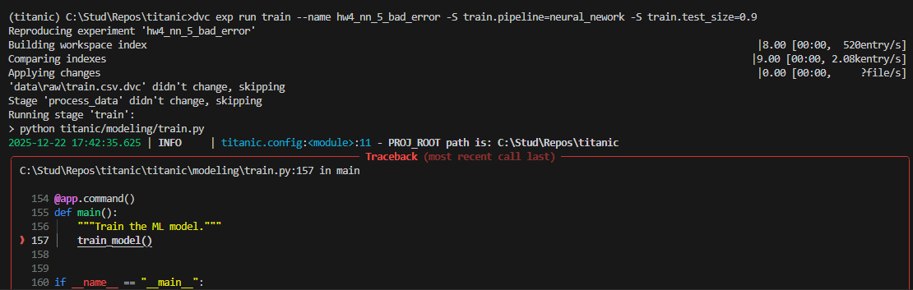
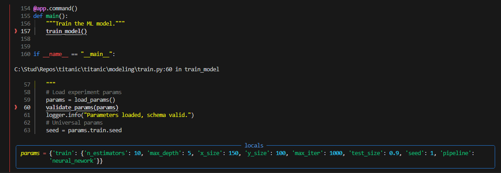
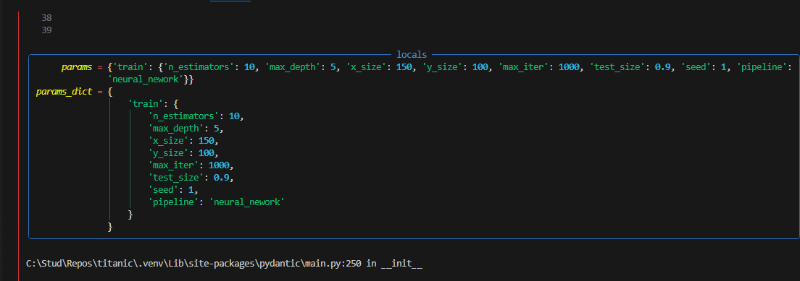
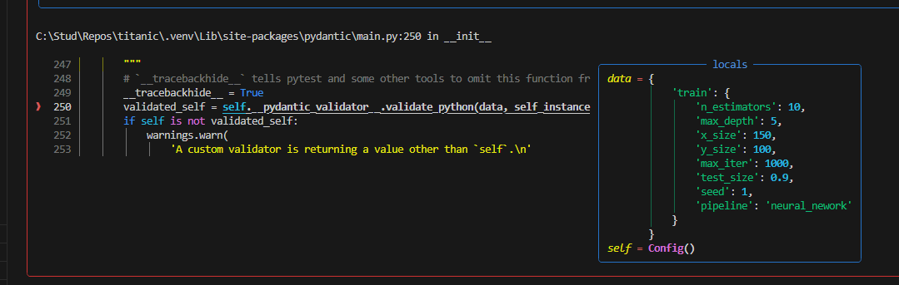
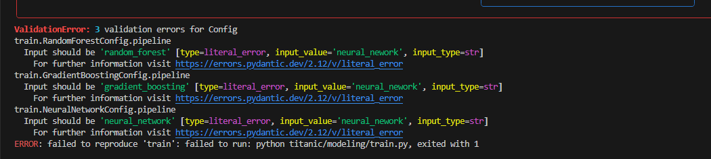
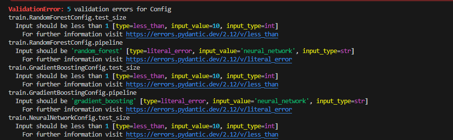

# Homework 4

Автоматизация ML пайплайнов

## Задача

---------------------------------

* **Баллы:** 10 баллов  

* **Срок сдачи:** 22 декабря

### Описание

Создайте автоматизированные ML пайплайны с использованием современных инструментов оркестрации.

### Требования

**Выберите ОДИН из инструментов для оркестрации пайплайнов:**

* **Snakemake** - Workflow management system
* **DVC Pipelines** - Data versioning pipelines
* **Apache Airflow** - Workflow orchestration platform
* **Luigi** - Python workflow management

**Выберите ОДИН из инструментов для управления конфигурациями:**

* **Hydra** - Configuration management framework
* **OmegaConf** - YAML configuration library
* **Pydantic** - Data validation and settings

1. **Настройка выбранного инструмента оркестрации (4 балла):**
    * Установить и настроить выбранный инструмент
    * Создать workflow для ML пайплайна
    * Настроить зависимости между этапами
    * Реализовать кэширование и параллельное выполнение
2. **Настройка выбранного инструмента конфигураций (3 балла):**
    * Настроить выбранный инструмент для управления конфигурациями
    * Создать конфигурации для разных алгоритмов
    * Настроить валидацию конфигураций
    * Создать систему композиции конфигураций
3. **Интеграция и тестирование (2 балла):**
    * Интегрировать выбранные инструменты
    * Создать систему мониторинга выполнения
    * Настроить уведомления о результатах
    * Протестировать воспроизводимость
4. **Отчет о проделанной работе (1 балл):**
    * Создать отчет в формате Markdown
    * Описать настройку выбранных инструментов
    * Добавить скриншоты результатов
    * Сохранить отчет в Git репозитории

### Критерии оценки

* **Отлично (10 баллов):** Полная автоматизация, надежные пайплайны
* **Хорошо (8-9 баллов):** Хорошая автоматизация, базовые пайплайны
* **Удовлетворительно (6-7 баллов):** Базовая автоматизация
* **Неудовлетворительно (0-5 баллов):** Требования не выполнены

**⚠️ ВАЖНО:** Менторы будут воспроизводить ваши результаты, поэтому постарайтесь все автоматизировать. Если что-то не совпадет при воспроизведении, можно потерять баллы.

## Ход работы

### 1

Для начала проверим соответствие заданию. Некоторые пункты уже могут быть готовы / частично готовы из предыдущих домашних заданий + из подготовки к семинарам.

**Выберите ОДИН из инструментов для оркестрации пайплайнов:**

Выбираем:

* **DVC Pipelines** - Data versioning pipelines (ВЫБРАН)

**Выберите ОДИН из инструментов для управления конфигурациями:**

Выбираем:

* **OmegaConf** - YAML configuration library

1. **Настройка выбранного инструмента оркестрации (4 балла):**
    * Установить и настроить выбранный инструмент
      * Есть (dvc поставлен, dvc.yaml, params.yaml + интеграция в коде)
    * Создать workflow для ML пайплайна
      * Есть (dvc.yaml, params.yaml + интеграция в коде)
    * Настроить зависимости между этапами
      * Есть (dvc.yaml, params.yaml + интеграция в коде)
        * Например, зависимость из этапа process_data идёт в этап train
    * Реализовать кэширование и параллельное выполнение
      * Есть. Кэширование DVC реализует сам. Параллельное выполнение выглядит [нереализуемым](https://discuss.dvc.org/t/running-multiple-dvc-pipeline-in-parallel/267) через DVC.
2. **Настройка выбранного инструмента конфигураций (3 балла):**
    * Настроить выбранный инструмент для управления конфигурациями
      * Есть (dvc.yaml, params.yaml + интеграция в коде через OmegaConf, dvc сам подставляет params и сопоставляет с аргументами запуска эксперимента)
    * Создать конфигурации для разных алгоритмов
      * Есть (в params.yaml прописаны параметры для разных алгоритмов - random_forest, gradient_boosting, neural_network)
    * Настроить валидацию конфигураций
      * Есть простая валидация в коде. Если в конфиге ошибка - не даст сделать train и выведет причину проблемы.
    * Создать систему композиции конфигураций
      * Есть - в моём случае для удобства всё в одном yaml-файле, делать больше - оверкилл. Дополнительные ключи-значения под разные пайплайны просто передаются в скрипт, и наличие необходимых введённых значений проверяются уже в самом скрипте. Мне удобнее задавать параметры через train.num_estimators, чем через train.random_forest.num_estimators. При этом композиция поддерживается, ведь мы вносим данные через train.(...), а не напрямую в корень.
3. **Интеграция и тестирование (2 балла):**
    * Интегрировать выбранные инструменты
      * Есть
    * Создать систему мониторинга выполнения
      * Есть через - dvc metrics, dvc через VS Code плагин и т.д.
    * Настроить уведомления о результатах
      * Есть - результаты видны в консоли, ошибки и успехи подсвечиваются соответствующим цветом (`loguru, logger.success`). Далее в ДЗ5 можно будет настроить более крутую интеграцию через ClearML.
    * Протестировать воспроизводимость
      * Есть - на компе и ноуте запускается.
4. **Отчет о проделанной работе (1 балл):**
    * Тут всё ясно - этот файл

Выходит, в общем-то всё готово `=)`

### 2

Для красоты сделаем более хорошую валидацию конфигов.

Внёс коммит и добавил валидацию параметров через Pydantic (Union для пайплайнов).
`titanic/schema/params_schema.py`
Обновил train.py для использования этой валидации, добавил принт.

Закоммитил.

Результаты:

всё ок

Ошибка валидации (neural_neWork указал в пайплайне)

Подпробуем сложнее: укажем test_size = 10

Как и ожидалось, ошибка:

Всё супер!
