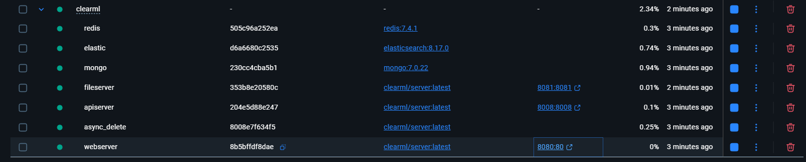
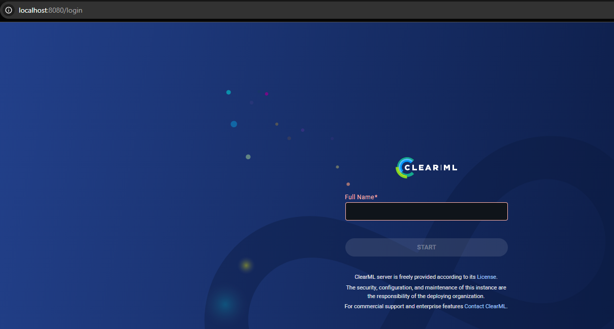
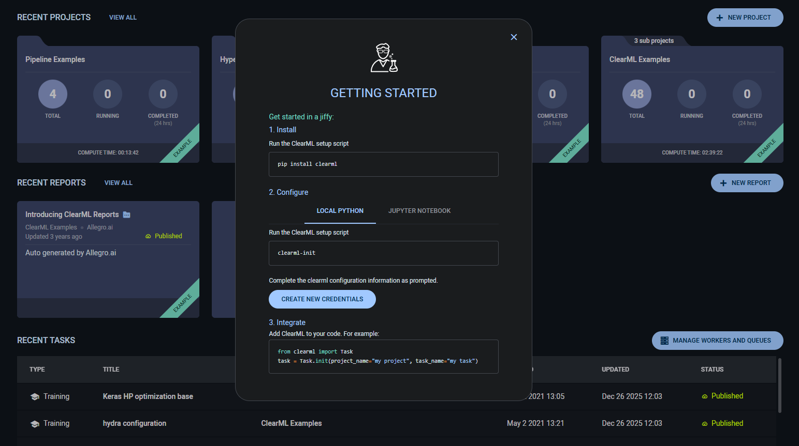
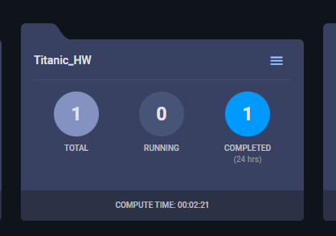

# ДЗ 5: ClearML для MLOps

-----------------------

* **Баллы:** 12 баллов  

* **Срок сдачи:** 26 декабря

## Задача

### Описание

Настройте ClearML для комплексного MLOps workflow и управления экспериментами.

### Требования

1. **Настройка ClearML (3 балла):**
    * Установить и настроить ClearML Server
    * Настроить базу данных и хранилище
    * Создать проект и эксперименты
    * Настроить аутентификацию
2. **Трекинг экспериментов (3 балла):**
    * Настроить автоматическое логирование
    * Создать систему сравнения экспериментов
    * Настроить логирование метрик и параметров
    * Создать дашборды для анализа
3. **Управление моделями (3 балла):**
    * Настроить регистрацию и версионирование моделей
    * Создать систему метаданных для моделей
    * Настроить автоматическое создание версий
    * Создать систему сравнения моделей
4. **Пайплайны (2 балла):**
    * Создать ClearML пайплайны для ML workflow
    * Настроить автоматический запуск пайплайнов
    * Создать систему мониторинга выполнения
    * Настроить уведомления
5. **Отчет о проделанной работе (1 балл):**
    * Создать отчет в формате Markdown
    * Описать настройку каждого инструмента
    * Добавить скриншоты результатов
    * Сохранить отчет в Git репозитории

### Критерии оценки

* **Отлично (12 баллов):** Полная настройка ClearML, качественный MLOps
* **Хорошо (10-11 баллов):** Хорошая настройка, базовый MLOps
* **Удовлетворительно (8-9 баллов):** Базовая настройка
* **Неудовлетворительно (0-7 баллов):** Требования не выполнены

**⚠️ ВАЖНО:** Менторы будут воспроизводить ваши результаты, поэтому постарайтесь все автоматизировать. Если что-то не совпадет при воспроизведении, можно потерять баллы.

## Ход работы

`git checkout -b hw5`

### 1. Ставим ClearML на мою винду по гайду

Делаем по [гайду](https://clear.ml/docs/latest/docs/deploying_clearml/clearml_server_win)

Моя платформа: Windows 11 Pro 25H2 64 Bit, build 26200.7171
Предвещаю боль... В доке даже нет про W11, только про W10...

```bash
mkdir c:\opt\clearml\data
mkdir c:\opt\clearml\logs
curl https://raw.githubusercontent.com/clearml/clearml-server/master/docker/docker-compose-win10.yml -o c:\opt\clearml\docker-compose-win10.yml
docker-compose -f c:\opt\clearml\docker-compose-win10.yml up
```

На удивление, завёлся:


### 2. Установка в проект и аутентификация

Веб-морда прогрузилась:



Зашёл, ввёл 3ndetz (имя GH), попал в дашборд.



Собственно, он сразу и говорит, что делать. Ставим зависимости сразу в pyproject.toml.
Для аккуратности, не будем через uv add, а делаем так:
`uv pip install clearml`
Видим версии:

```bash
Installed 6 packages in 151ms
 + clearml==2.1.0
 + furl==2.1.4
 + orderedmultidict==1.0.2
 + pathlib2==2.3.7.post1
 + pillow==12.0.0
 + pyjwt==2.10.1
```

Вносим `clearml~=2.1.0` в зависимости в pyproject.toml.

Запомним его рекомендацию

```py
from clearml import Task
task = Task.init(project_name="my project", task_name="my task")
```

Потом так и начнём внедрять в код, но сначала сделаем креды.

Выполняем `clearml-init`.

А пока тыкнем на CREATE NEW CREDENTIALS прямо из старт-окна.

Выдал ключанские:

```text
api {
  web_server: http://localhost:8080
  api_server: http://localhost:8008
  files_server: http://localhost:8081
  credentials {
    "access_key" = "КЛЮЧ_ДОСТУПА"
    "secret_key" = "СЕКРЕТНЫЙ_КЛЮЧ"
  }
}
```

clearml-init запрашивает как раз эти креды, вставляем ему в консоль.

```bash
Port 8080 is the web port. Replacing 8080 with 8008 for API server

ClearML Hosts configuration:
Web App: http://localhost:8080
API: http://localhost:8008
File Store: http://localhost:8081

Verifying credentials ...
Credentials verified!

New configuration stored in C:\Users\jayra\clearml.conf
ClearML setup completed successfully.
```

Креды готовы, теперь можно тыкаться в код.

### 3. Интеграция ClearML в код


#### Тест

Сначала проверим, работает ли оно вообще.
Из корня репки запустим вот это:

```py
from clearml import Task

# Эта строчка сама создаст Проект "Titanic_HW" и Эксперимент "Setup_Check"
task = Task.init(project_name="Titanic_HW", task_name="Setup_Check")

print("ClearML работает!")
task.close()
```

Отлично, работает!



Правда, долго, секунд 20. Но работает.

#### Интеграция в код

Засунул Task в `titanic/dataset.py` в функцию process_data, чтобы логировался этап подготовки данных.
После функции добавил `task.close()`, чтобы явно закрыть таск.

Теперь к `titanic/modeling/train.py`.

Добавим инит таска, аплоад модели и метрик после трейна.
Коммитим.

#### Запуск в коде

Проверим repro чтобы дата процесснулась и это попало в CML

dvc repro

dvc exp run train --name hw5_rf_3_fix -S train.pipeline=random_forest -S train.n_estimators=15 -S train.max_depth=10
dvc exp run train --name hw5_rf_4_bad -S train.pipeline=random_forest -S train.test_size=0.5
dvc exp run train --name hw5_nn_3_test3 -S train.pipeline=neural_network -S train.x_size=150 -S train.y_size=200
dvc exp run train --name hw5_nn_4_bad -S train.pipeline=neural_network -S train.test_size=0.5
