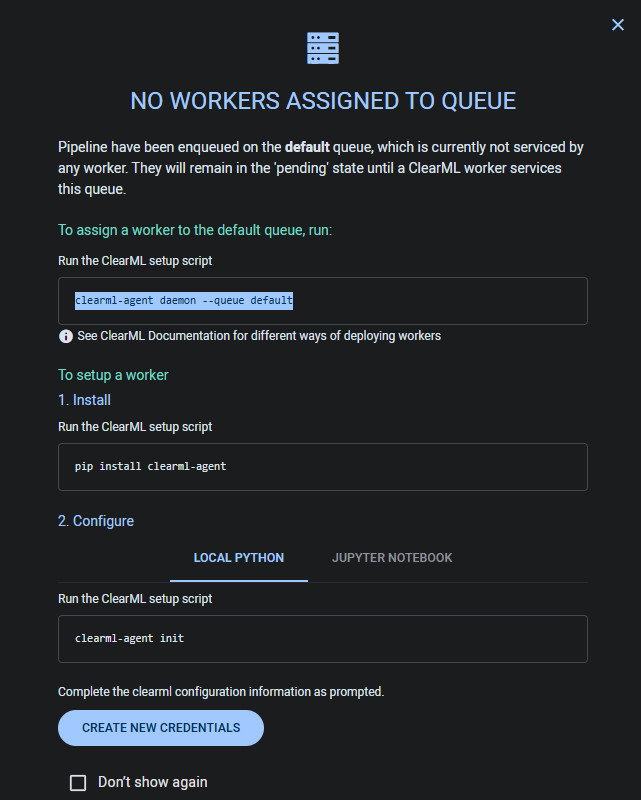
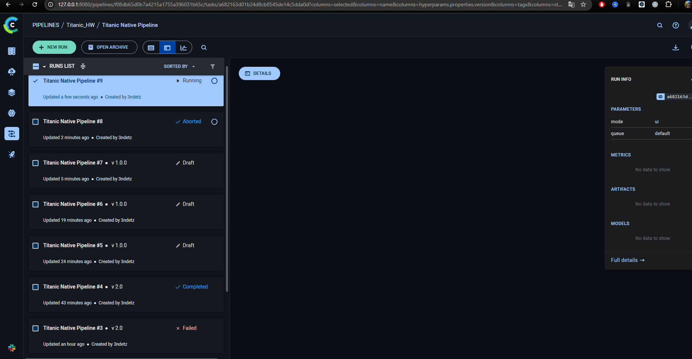
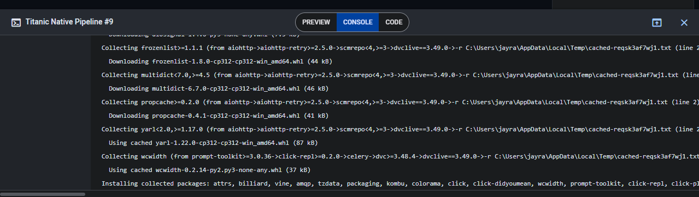
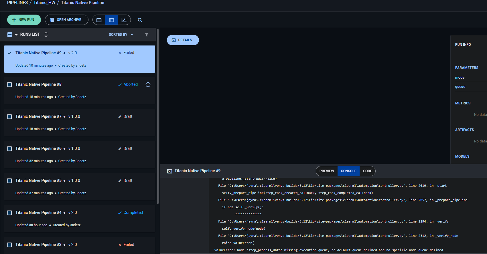
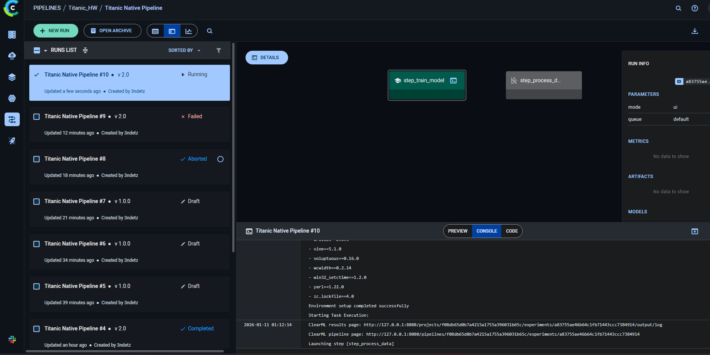

# HW 5 FIX

## Комментарии:

### 1. АвтоЗапуск используется только PipelineDecorator.run_locally(), нет автоматического запуска через очередь или планировщик

### 2. Модели загружаются как артефакты через task.upload_artifact(), а надо использовать OutputModel

## Ход исправления

Входим в ветку hw5-fix (отделяем от hw6 т.к. она ещё не вмерджена в main но изменения резонные).

### OutputModel fix

Сначала исправим вторую проблему, т.к. она проще (`Модели загружаются как артефакты через task.upload_artifact(), а надо использовать OutputModel`).

Добавим OutputModel в `titanic/modeling/train.py`.

- Заменён `task.upload_artifact()` для модели на `OutputModel` и `update_weights`.

Закоммитим.

### Автоматический запуск не через run_locally

Теперь сразу приступим к 1 проболеме т.к. всё равно эксперименты запускать. `АвтоЗапуск используется только PipelineDecorator.run_locally(), нет автоматического запуска через очередь или планировщик`

Откроем пайплайны в ClearML и попробуем создать "NEW RUN". Ставим queue "default" и поставим у себя воркер. Нам помог ClearML сам:



```bash
(titanic) C:\Stud\Repos\titanic>uv pip install clearml-agent            
Resolved 13 packages in 1.55s
Prepared 2 packages in 813ms
Uninstalled 1 package in 30ms
Installed 2 packages in 250ms
 + clearml-agent==2.0.6
 - psutil==7.1.3
 + psutil==7.0.0
 ```

Добавим новые зависимости в pyproject.toml и закоммитим.

Запустим clearml-agent init

```bash
clearml-agent init

...

Configuration file already exists: C:\Users\jayra\clearml.conf

clearml-agent daemon --queue default

...

Worker "onixpc:0" - Listening to queues:
+----------------------------------+---------+-------+
| id                               | name    | tags  |
+----------------------------------+---------+-------+
| a436beeaf73c481698611327bea84b27 | default |       |
+----------------------------------+---------+-------+
```

Воркер запущен. Теперь когда мы дадим таск на clearml, воркер должен взять его на выполнение.

Теперь обновим clearml_pipeline.py чтобы можно было запускать через планировщик.

Просто убираем `PipelineDecorator.run_locally()`, ведь у нас настроен воркер. Ну для красоты добавим запуск через параметры.

Запускаем:

```bash
(titanic) C:\Stud\Repos\titanic>python clearml_pipeline.py --mode ui
ClearML Task: created new task id=a682163d01b24d8cb8545de14c5dda0d
ClearML results page: http://127.0.0.1:8080/projects/f08db65d0b7a4215a1755a396031b65c/experiments/a682163d01b24d8cb8545de14c5dda0d/output/log
ClearML pipeline page: http://127.0.0.1:8080/pipelines/f08db65d0b7a4215a1755a396031b65c/experiments/a682163d01b24d8cb8545de14c5dda0d
Switching to remote execution, output log page http://127.0.0.1:8080/projects/f08db65d0b7a4215a1755a396031b65c/experiments/a682163d01b24d8cb8545de14c5dda0d/output/log
ClearML Terminating local execution process - continuing execution remotely
```

Видим



Воркер работает в своей среде



Запуск провален, надо вручную в компонентах пайплайна указать название queue на default...



Указываем и запускаем ещё раз.

Видим, что запуск пошёл.



Не заработало. Во-первых clearml агент неправильно сам резолвит зависимости. Во-вторых неясно соответствие времени scheduler'а и локального - возможно он ждёт.

Проверим аплоад модели локально и попробуем повторить пайплайн, запущенный через run_locally.
