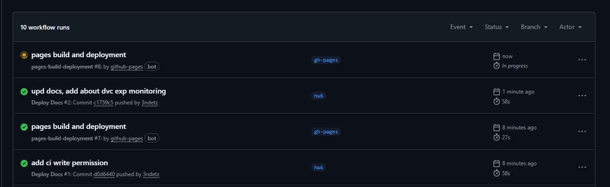
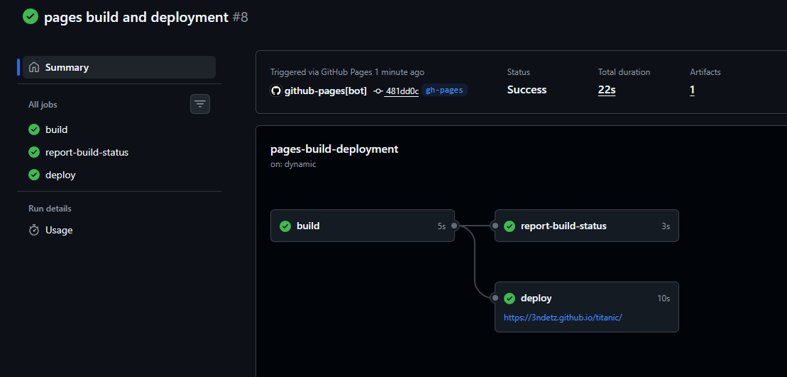
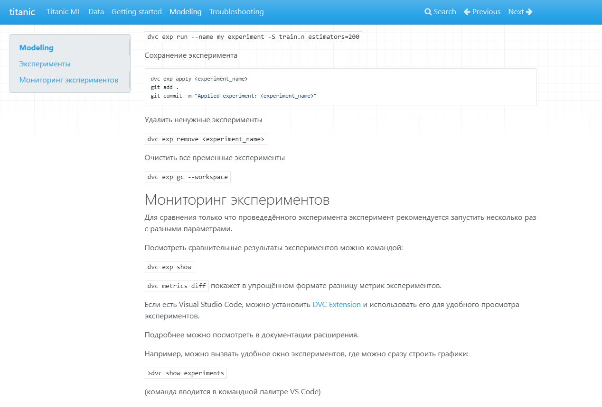

# ДЗ 6: Документация и отчеты

---------------------------

## Задача

* **Баллы:** 8 баллов  

* **Срок сдачи:** 26 декабря

### Описание

Создайте полную документацию проекта и систему генерации отчетов.

### Требования

1. **Техническая документация (2 балла):**
    * Создать документацию с помощью Sphinx или MkDocs
    * Создать руководство по развертыванию
    * Настроить автоматическую генерацию документации
    * Создать примеры использования
2. **Публикация в Git Pages (3 балла):**
    * Настроить GitHub Actions для автоматической публикации
    * Создать сайт с документацией на Git Pages
    * Настроить автоматическое обновление при изменениях
3. **Отчеты об экспериментах (2 балла):**
    * Создать отчеты об экспериментах в формате Markdown
    * Добавить графики и визуализации результатов
    * Создать сравнительные таблицы экспериментов
    * Настроить автоматическую генерацию отчетов
4. **Воспроизводимость (1 балл):**
    * Создать инструкции по воспроизведению
    * Создать README с полным описанием
    * Настроить автоматическую сборку документации

### Критерии оценки

* **Отлично (8 баллов):** Полная документация, качественные отчеты
* **Хорошо (6-7 баллов):** Хорошая документация, базовые отчеты
* **Удовлетворительно (4-5 баллов):** Базовая документация
* **Неудовлетворительно (0-3 балла):** Требования не выполнены

**⚠️ ВАЖНО:** Менторы будут воспроизводить ваши результаты, поэтому постарайтесь все автоматизировать. Если что-то не совпадет при воспроизведении, можно потерять баллы.

## Ход работы

Рассмотрим выполнение каждого из пунктов задания.

1. **Техническая документация (2 балла):**
    * Создать документацию с помощью Sphinx или MkDocs
      * Есть на MkDocs (базово)
    * Создать руководство по развертыванию
      * Есть (базово)
    * Настроить автоматическую генерацию документации
      * По сути создаётся из Markdown файлов автоматически, можно разве что подтянуть структуру кода
    * Создать примеры использования
      * Есть (базово)
2. **Публикация в Git Pages (3 балла):**
    * Настроить GitHub Actions для автоматической публикации
      * Делается через `cd docs`, `mkdocs gh-deploy`
    * Создать сайт с документацией на Git Pages
      * Есть <https://3ndetz.github.io/titanic>
    * Настроить автоматическое обновление при изменениях
      * Можно настроить через ci-cd и вставить в workflow github actions
3. **Отчеты об экспериментах (2 балла):**
    * В целом не готово.
      * Создать отчеты об экспериментах в формате Markdown
      * Добавить графики и визуализации результатов
        * Есть из dvc в VSC и в clearml, но можно сделать сразу отбивку в доки
      * Создать сравнительные таблицы экспериментов
      * Настроить автоматическую генерацию отчетов
        * В целом, видимо, этим и будем заниматься
4. **Воспроизводимость (1 балл):**
    * Создать инструкции по воспроизведению
      * есть
    * Создать README с полным описанием
      * Есть
    * Настроить автоматическую сборку документации
      * Есть, mkdocs gh-deploy уже работает

Приступаем к выполнению. Начнём с gh actions. Потом сделаем пример авто-отчёта по эксперименту.

Добавил CI по [примеру](https://github.com/marketplace/actions/mkdocs-action), настроил его под наш репо. Закоммитил.

Пошли коммиты, пошли actions:

Внесённое изменение сразу отобразилось:

Отлично, всё работает! Идём дальше.
