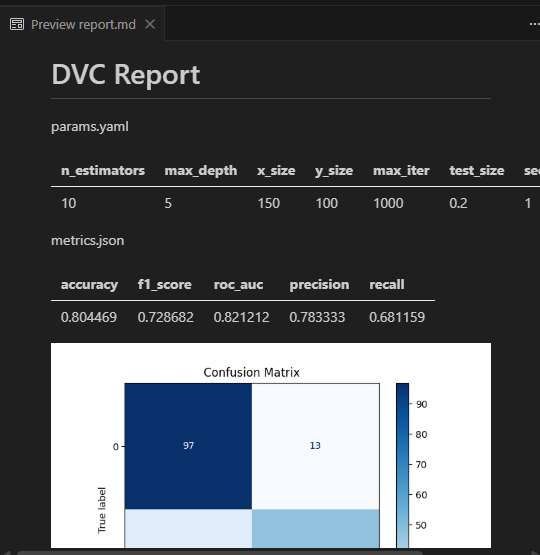
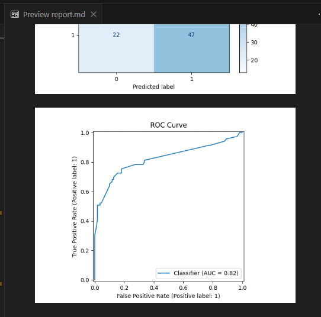

# HW 6 Fix

Комментарий: нет отчетов об экспериментах (должны выгружаться в io)

## Эксперименты: текущий статус

`dvc exp run train --name hw6f_nn_6 -S train.pipeline=neural_network -S train.test_size=0.2`

```bash

(titanic) C:\Stud\Repos\titanic>dvc exp run train --name hw6f_nn_6 -S train.pipeline=neural_network -S train.test_size=0.2
Reproducing experiment 'hw6f_nn_6'                                                                                                                                             
Building workspace index                                                                                                                             |8.00 [00:00,  438entry/s]
Comparing indexes                                                                                                                                   |9.00 [00:00, 2.57kentry/s]
Applying changes                                                                                                                                     |2.00 [00:00,   229file/s]
'data\raw\train.csv.dvc' didn't change, skipping                                                                                                                               
Stage 'process_data' is cached - skipping run, checking out outputs                                                                                                            
Updating lock file 'dvc.lock'                                                                                                                                                  

Running stage 'train':                                                                                                                                                         
> python titanic/modeling/train.py
C:\Stud\Repos\titanic\.venv\Lib\site-packages\dvclive\monitor_system.py:11: FutureWarning: The pynvml package is deprecated. Please install nvidia-ml-py instead. If you did not install pynvml directly, please report this to the maintainers of the package that installed pynvml for you.
  from pynvml import (
2026-01-10 20:46:23.591 | INFO     | titanic.config:<module>:11 - PROJ_ROOT path is: C:\Stud\Repos\titanic
2026-01-10 20:46:23.930 | INFO     | titanic.utils:wrapper:20 - Starting: train_model
2026-01-10 20:46:24.327 | INFO     | __main__:train_model:72 - Parameters loaded, schema valid.
ClearML Task: created new task id=9dae97d92ffe4cb6b98e4d5f8348dd5c
ClearML results page: http://127.0.0.1:8080/projects/7509acc37c7e472688faba0485199aec/experiments/9dae97d92ffe4cb6b98e4d5f8348dd5c/output/log
2026-01-10 20:46:25.328 | INFO     | __main__:train_model:98 - Chosen neural network pipeline
2026-01-10 20:46:25.328 | INFO     | titanic.utils:log_stage:38 - 🔄 Stage: Data Loading
2026-01-10 20:46:25.413 | INFO     | titanic.utils:log_stage:43 - ✓ Data Loading completed (0.08s)
2026-01-10 20:46:25.413 | INFO     | titanic.utils:log_stage:38 - 🔄 Stage: Model Training
2026-01-10 20:46:27.363 | INFO     | titanic.utils:log_stage:43 - ✓ Model Training completed (1.95s)
2026-01-10 20:46:27.363 | INFO     | titanic.utils:log_stage:38 - 🔄 Stage: Model Evaluation
2026-01-10 20:46:28.261 | INFO     | titanic.utils:log_stage:43 - ✓ Model Evaluation completed (0.90s)
2026-01-10 20:46:28.261 | INFO     | __main__:train_model:172 - Metrics: {'accuracy': 0.8044692737430168, 'f1_score': 0.7286821705426356, 'roc_auc': 0.8212121212121213, 'precision': 0.7833333333333333, 'recall': 0.6811594202898551}
2026-01-10 20:46:28.263 | INFO     | titanic.utils:log_stage:38 - 🔄 Stage: Saving Model
2026-01-10 20:46:28.265 | INFO     | titanic.utils:log_stage:43 - ✓ Saving Model completed (0.00s)
C:\Stud\Repos\titanic\.venv\Lib\site-packages\dvc_render\vega.py:169: UserWarning:

`generate_markdown` can only be used with `LinearTemplate`

2026-01-10 20:46:28.660 | SUCCESS  | titanic.utils:wrapper:25 - Completed: train_model (4.73s)
Updating lock file 'dvc.lock'                                                                                                                                                  
                                                                                                
Ran experiment(s): hw6f_nn_6
Experiment results have been applied to your workspace.
```


Сгенерирован отчет:





Предположим, нам понравились параметры и хотим его сохранить.

Вся инфа с отчётом ложится в папку dvclive, которую я пока что игнорирую гитом намеренно, т.к. хочу, чтобы мы сохряняли только важные отчёты в доку сами. Сделаем для этого автоматизированный скрипт, чтобы эксперимент логировался и оно публиковалось в доку и автодеплоилось с новым отчётом.

Посмотрим на структуру файла dvclive/report.md:

```markdown
# DVC Report

params.yaml

|   n_estimators |   max_depth |   x_size |   y_size |   max_iter |   test_size |   seed | pipeline       |
|----------------|-------------|----------|----------|------------|-------------|--------|----------------|
|             10 |           5 |      150 |      100 |       1000 |         0.2 |      1 | neural_network |

metrics.json

|   accuracy |   f1_score |   roc_auc |   precision |   recall |
|------------|------------|-----------|-------------|----------|
|   0.804469 |   0.728682 |  0.821212 |    0.783333 | 0.681159 |

![confusion_matrix.png](data:image/png;base64,iVBORw0KGg
```

Как видим, файл ни на что не ссылается, значит можно просто вставить md'шку в доку и она сама подцепит его!

Cltkfnm

Добавим, что в идеальном сценарии нам нужно также добавить систему комментариев для экспериментов, чтобы можно было делать вызов уровня `make report --comment "New bad experiment"`, который будет добавляться к эксперименту.
